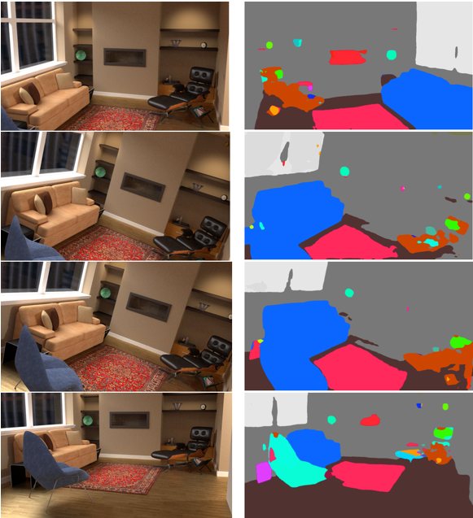

# PointCloudSegmentation

  

# Point Cloud Segmentation

In the project, I am trying to solve the 3D point cloud segmentation based on indoor scene. The point clouds that I am using come from two resources, one part come from simulated environment created from Gazebo(robot simulation system), the other part generate from photogrammetry pipeline implemented using COLMAP. The demonstration with include two parts.

  - Use Velodyne HDL-32E to generate point cloud and pinhole model to generate RGB images. Display the projection and back-projection process.
  - Show the images rendered using Blender Cycle and run semantic segmentation network on realistic images pretrained by "Pytorch implementation for Semantic Segmentation/Scene Parsing on MIT ADE20K dataset"http://sceneparsing.csail.mit.edu/
  - Merge the point clouds projected from different poses and postions of the camera to reconstruct the indoor segmented point cloud.

# New Features!

  - Set up Gazebo environment to generate high quality images to make up the shortage of 3D data.
  - Render realistic images to supplement  deep learning training process.
  - Use 2D methods to solve 3D problems

